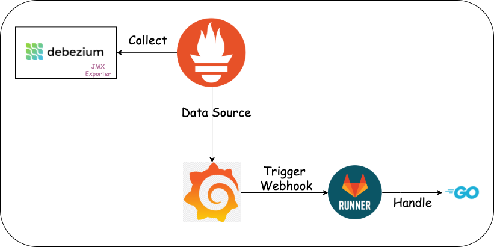

# Overall Architecture

For details, you can read [the article](https://medium.com/modanisa-engineering/integrating-grafana-notifications-with-gitlab-pipeline-to-restart-debezium-tasks-using-go-1378c9eaf7b8).